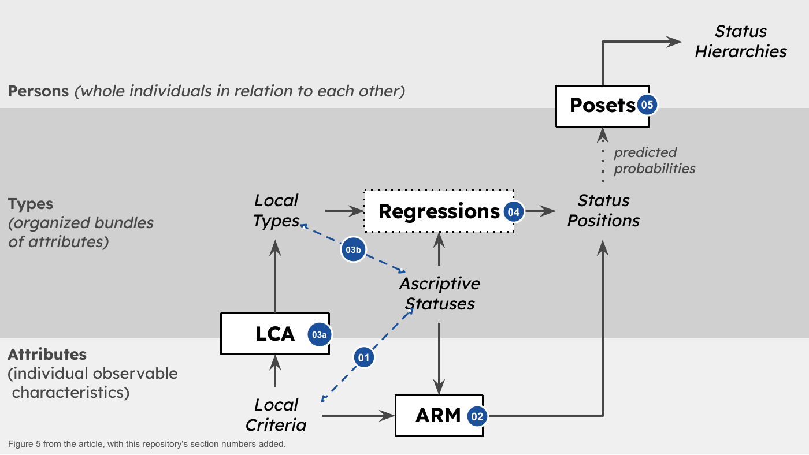
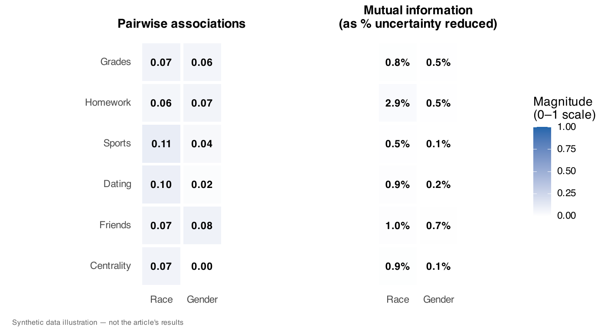
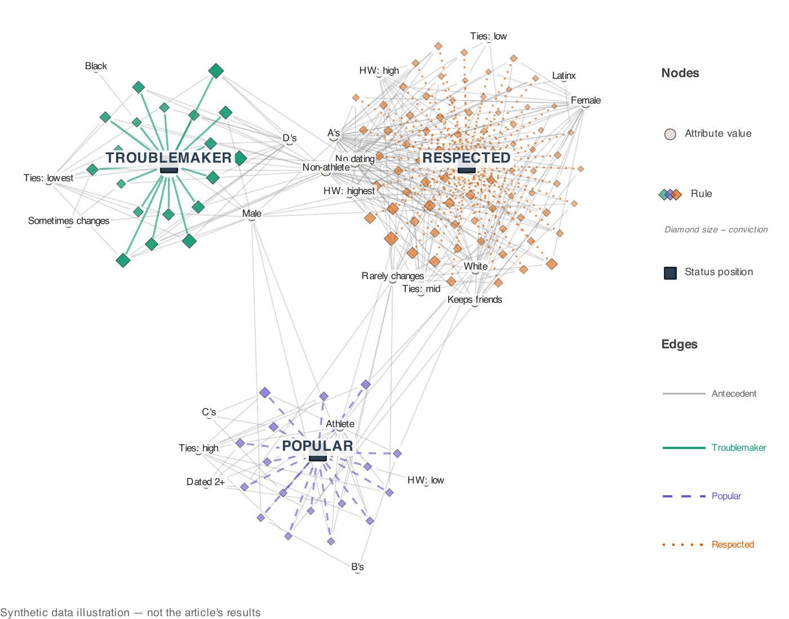
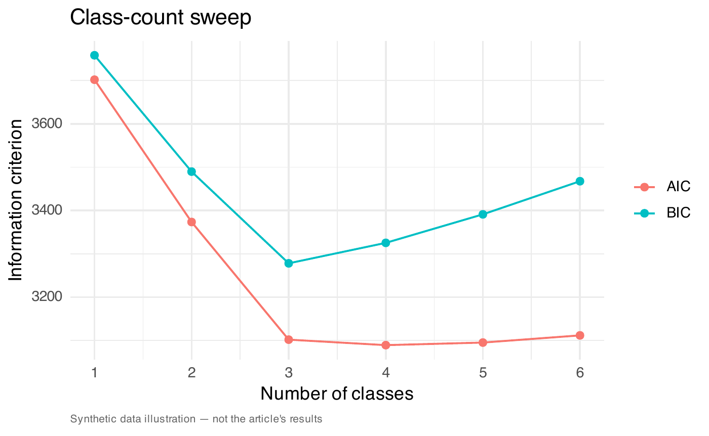
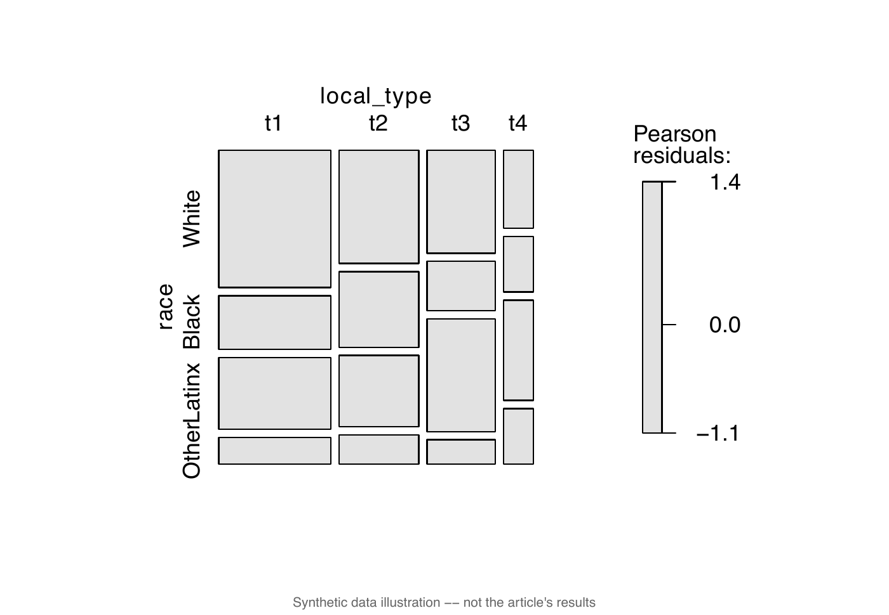
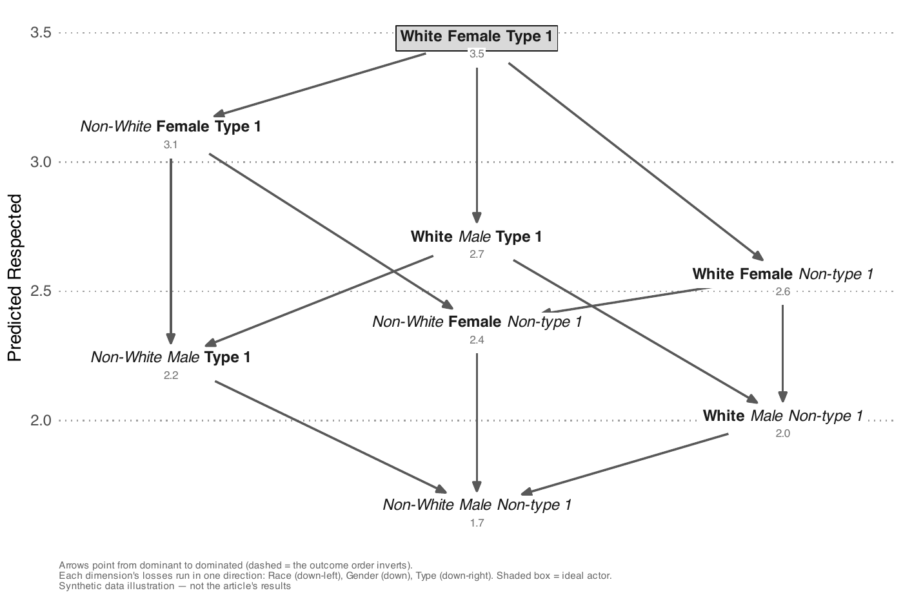
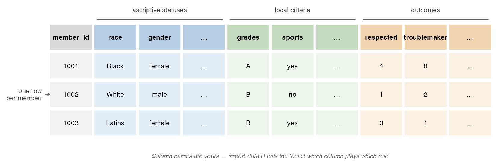

# Organizational Consolidation Toolkit

This repository accompanies the article "Organizational Consolidation:
How Organizations Reflect or Refract Societal Hierarchies" (Hoagland and
Shepherd, forthcoming in *American Sociological Review*) and provides its
concept-methods package—association rule mining (ARM), latent class
analysis (LCA), and partial order set modeling (posets)—as analytic tools
you can adapt to your organizational setting. The article defines
organizational consolidation as "the degree to which ascriptive
statuses—race, gender, class—align with the local criteria that
organizational actors use when evaluating one another—skills,
performance indicators, communication styles, peer ties, and the like."

The demonstrations in this repository **use synthetic data**—invented
schools at low, moderate, and high organizational consolidation—because
the article's data were collected under an IRB protocol that does not
permit public sharing, given the small size of the school and the
detailed information about respondents. The figures show what the
methods produce, **not the article's findings**.


## From Attributes to Status Hierarchies

The article's Figure 5 shows how the methods work together—moving from
individual attributes, to types of people, to whole persons in relation
to each other:



The numbered folders in [`methods/`](methods) follow the figure. [01](methods/01-measure-consolidation) is the initial
assessment—the dashed link between local criteria and ascriptive
statuses, measured with pairwise associations and mutual information.
[02](methods/02-association-rule-mining) is ARM. [03](methods/03-latent-class-analysis) is LCA (03a), which also produces the second dashed link,
03b: Cramér's V between local types and ascriptive statuses, the
article's most direct assessment of organizational consolidation. [04](methods/04-regression) is
the regressions, and [05](methods/05-status-hierarchy) the posets. Use the methods in sequence or on
their own.

## How this repository is organized

| Path | What it is |
|---|---|
| [`synthetic_walkthrough.Rmd`](synthetic_walkthrough.Rmd) | start here — the synthetic illustration with the code |
| [`import-data.R`](import-data.R) | import and define the dataset — which table the methods read and what each column is |
| [`methods/01..05/`](methods) | apply each method to your data |
| [`docs/`](docs) | how the methods connect, how to read results, poset design notes |
| [`data/`](data) | data requirements and the three synthetic files |
| [`R_functions/`](R_functions) | the functions the method scripts call |
| [`images/`](images) | the figures in this README; five of them are method outputs |
| [`output/`](output) | the figures and tables the methods save; `run_name` in `import-data.R` keeps separate runs apart |

## The Concept-Methods Package

The sections below keep the order of the article's Empirical
Illustration.

**None of the figures in these sections reproduce the article's
figures.** They come from the bundled synthetic data. Run the code to
regenerate them, along with their moderate- and high-consolidation
versions.

### An Initial Assessment of Organizational Consolidation ([`methods/01`](methods/01-measure-consolidation))

The first step is an initial assessment: pairwise associations and
mutual information between each ascriptive status and each local
criterion. As in the article, the script measures each pair with the
statistic matched to its levels of measurement and reports it as a 0–1
magnitude.
Read the magnitudes against Cohen's conventional effect-size
thresholds—roughly 0.1 (low), 0.3 (medium), and 0.5 (high). In the
bundled school every association is weak—the low-consolidation regime,
playing the role of the article's case study. The pairwise
relationships do not capture how criteria combine or whether
combinations of criteria align with ascriptive statuses as a whole; the
methods that follow capture both.



### Surfacing Salient Attributes: Association Rule Mining ([`methods/02`](methods/02-association-rule-mining))

Association rule mining (ARM) works at the level of individual attributes.
Whereas regression models estimate the average effect of independent
predictors, ARM identifies if–then rules (if [Trait A + Trait B], then
[Status Position X]) that reveal how attributes convey meaning in
relation. Its analytic payoff is twofold: it tests conditional
salience—which attributes function as reliable standalone cues and
which gain meaning only in bundles—and it makes polysemy quantitatively
visible, showing how the same attribute shifts meaning across pairings:



### Identifying Local Types: Latent Class Analysis ([`methods/03`](methods/03-latent-class-analysis))

This section does the two things marked 03a and 03b in the figure.

**03a — the types.** Latent class analysis (LCA) moves from attributes
to types. It compresses individual attributes into **local
types**—recurring profiles of co-occurring criteria that organizational
actors may plausibly recognize as types of people. Classes are
anonymous ("type 1", "type 2", ...) until you interpret their response
profiles and name them in `import-data.R`—naming is a finding, never an
input. The section saves a **run of record** so that every later script
uses the same classes. The class-count sweep shows the fit
statistics that inform, but do not make, the class-count judgment call:



**03b — the alignment.** Whether local types overlap with or cut across
ascriptive statuses is the most direct assessment of organizational
consolidation, and a standardized basis for comparing across
organizations. The script measures the alignment with Cramér's V and
draws it as mosaics—does membership in a local type follow ascription,
or cut across it?



### Local Types as Regression Inputs ([`methods/04`](methods/04-regression))

Local types also serve as inputs for regression analyses: using
LCA-derived profiles as inputs preserves the relational structure that
ARM surfaced, rather than decomposing it back into independent effects.
Zero-inflated Poisson regressions predict recognition (nomination
counts) from ascriptive statuses and local type together, and generate
the per-profile predictions the posets order.

### Mapping Intersectionality: Partial Order Set Modeling ([`methods/05`](methods/05-status-hierarchy))

Partial order set modeling—working with partially ordered sets,
"posets"—shifts from types to whole persons. Unlike rankings that
compress everyone into a single yardstick, posets preserve
multidimensional relationships. The **ideal actor** is the
intersectional profile that receives maximum recognition; proximity to
this ideal concentrates esteem, and distance from it directs stigma.
The script arranges profiles by how many high-value characteristics
they share with the ideal, then places each at its predicted
recognition—the article's two-step construction. The shape is what you
read: the shape recognition takes over the order. The dimensions you
chose fix the order, which profiles dominate which; consolidation shows
in how recognition is laid over it. In high
consolidation contexts recognition follows a near-linear chain, flowing
along predictable, stereotype-like patterns; moderate consolidation
produces a diamond-like structure with greater ambiguity about who
outranks whom; in low consolidation contexts, looser alignments generate
lattice-like pathways, where diverse profiles are distributed across
multiple routes without necessarily flattening inequalities. To compare
runs, set `run_name` in `import-data.R` so each keeps its own outputs, and
`poset_axis_limits` to pin their drawings onto one shared scale.



## Installation

The packages the toolkit uses are listed in [`dependencies.R`](dependencies.R). Install
them however you usually do—or install the exact versions we used. The
lockfile (`renv.lock`) is here but the `renv` package is not bundled, so
install it first, then restore from the repo root:

```r
install.packages("renv")   # if you do not already have it
renv::restore()            # offers to activate the project first: say yes
```

`renv::restore()` installs the pinned versions into a project library and,
once the project is activated, R uses that library whenever it starts in
this folder.

Knitting the walkthrough (below) also needs **Pandoc**. RStudio ships
it; outside RStudio, install Pandoc (`pandoc.org/installing`).

## Synthetic Illustration with the code

[`synthetic_walkthrough.Rmd`](synthetic_walkthrough.Rmd) walks through
the article's Empirical Illustration with the code for each step. It
runs on the table `import-data.R` names, which as shipped is the
synthetic low-consolidation file. Knit it in RStudio, or render it from
the repository root:

```r
rmarkdown::render("synthetic_walkthrough.Rmd", output_dir = "output")
```

which writes `output/synthetic_walkthrough.html` with the narration,
code, results, and figures on one page. Knit to PDF works too, given a
LaTeX installation (`tinytex::install_tinytex()` provides one). To see
the same walkthrough on the moderate or high file, or on your own
table, change `data_path` and knit again.

## Adapting to your data

The full requirements are in
[`data/data-dictionary.md`](data/data-dictionary.md). In short: the
methods read one table, as a CSV or RDS file—one row per member of the
organization, with columns for the member id, the ascriptive statuses,
the local criteria, and the recognition each member received:



If you have network data, compute each member's measures first (degree
centrality, for example) and include them as variable columns. If your
data come from administrative records rather than observed criteria,
read the section
[**Two kinds of data**](data/data-dictionary.md#two-kinds-of-data)
in `data/data-dictionary.md` first.

1. **Open the project in RStudio** by double-clicking
   [`organizational-consolidation-toolkit.Rproj`](organizational-consolidation-toolkit.Rproj), and copy your data
   file into the project folder.
2. **Fill in [`import-data.R`](import-data.R).** The file is a short form, and the bundled
   version is a completed example: replace the values in its required
   block with your file's path and your column names for each role
   (everything below the optional line can stay as it is). You do this
   once; every script reads it.
3. **Run it, then run the methods**, from the console:

```r
source("import-data.R")   # imports your table and checks it against the requirements
source("methods/01-measure-consolidation/measure-consolidation.R")
source("methods/02-association-rule-mining/mine-attribute-bundles.R")
source("methods/03-latent-class-analysis/recover-local-types.R")
source("methods/04-regression/predict-recognition.R")
source("methods/05-status-hierarchy/build-status-hierarchy.R")
```

Your file does not need to be pristine. When the checking script finds
something that breaks the requirements, it stops and says what to fix;
when it finds something merely worth knowing about—missing values,
small groups—it warns you and continues.

The methods leave two decisions to you, and you make both in
`import-data.R`. The first, at methods/03, is how many local types your
organization has: run the section once, read the class-count sweep it
saves, set `n_types` to your answer, and run it again so that sections
04 and 05 use your choice. The second, at methods/05, is
which outcome the status hierarchy is drawn for: set `focal_outcome`
to one of your outcome columns, and re-run methods/05 with a different
one to draw its hierarchy instead (a valued recognition, like the
article's "respected"; for a stigma label the "ideal" is the most
stigmatized profile—see the decisions guide). Every other choice has a
default—the rule-mining thresholds, whether rules count members or
nominations, which dimensions define a status profile—and
[`docs/decisions-you-will-face.md`](docs/decisions-you-will-face.md)
covers each one, with what the article's case study chose.

## Troubleshooting

- **`renv::restore()` fails or is slow** — if you declined the offer to
  activate, run `renv::activate()` in the repo root, restart R there, and
  retry; on a fresh machine install a current `renv` first
  (`install.packages("renv")`).
- **`poLCA` will not install** — it needs a working compiler toolchain on
  some platforms; on macOS install the Xcode command-line tools
  (`xcode-select --install`) and retry.
- **`rmarkdown::render()` fails with a Pandoc error** — rendering needs
  Pandoc. Knit inside RStudio, which bundles it, or install Pandoc
  (`pandoc.org/installing`).
- **"no saved local types match this data"** — run `methods/03` first;
  it saves the run of record the other sections use. The message
  is a safeguard, not an error: it prevents one dataset's classes from
  being silently reused on another.
- **A different class count or class numbering than the bundled
  examples** — expected. Class numbers are specific to your run of
  record; interpret the class-probability table before naming anything.

## Citing

If you use the toolkit, please cite the article:

> Hoagland, Brent, and Hana Shepherd. Forthcoming. "Organizational
> Consolidation: How Organizations Reflect or Refract Societal
> Hierarchies." *American Sociological Review*.
> https://doi.org/10.1177/00031224261475238

The code is MIT licensed ([`LICENSE`](LICENSE)); [`CITATION.cff`](CITATION.cff) contains the same
citation in machine-readable form.

## Statement about AI use

The analyses were designed, written, and run by the authors for the
article, prior to and independent of AI assistance. AI tooling
(Anthropic's Claude) was then used to help convert that original
codebase into this public-facing companion repository—reorganizing,
documenting, and packaging the code for reuse. The methods, analytic
decisions, and results are the authors' own.
